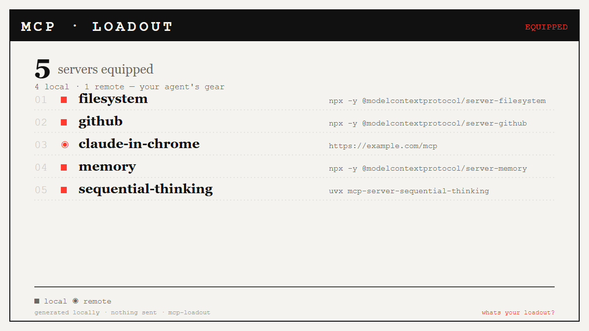

# mcp-loadout

Turn your local MCP config into an RPG-style **"AI loadout"** share card.

> ローカルのMCP設定をRPG風の装備カードSVGに変換するCLI。依存ゼロ・ネット送信ゼロ。「自分のMCP装備」を共有して相手の構成を聞く小ネタにも。

Your agent is only as capable as the tools it's equipped with. `mcp-loadout` reads
the MCP servers in your Claude config and renders them as an equipment / status
screen — one server per slot, local vs. remote marked, total gear count up top.
Then you share *"here's my MCP loadout"* and ask people what's on theirs.



## Privacy — nothing is sent

This is a local-only CLI. It reads a JSON file on your machine and writes an SVG
next to it. There is **no network access** at all — no `fetch`, no telemetry, no
uploads. The card you share is the only thing that leaves your machine, and only
if *you* post it. Server names + the launch command/url are all it reads; it never
opens or runs your servers.

## Usage

```bash
node mcp-loadout.mjs                 # auto-detect your MCP config, write loadout.svg
node mcp-loadout.mjs path/to/config.json
node mcp-loadout.mjs --demo          # built-in sample config (no real data)
node mcp-loadout.mjs --out card.svg  # choose the output path
node mcp-loadout.mjs --selftest      # run the parser/SVG assertions
```

Zero dependencies. Just Node (built-in modules only) — no `npm install`.

### Config auto-detection

If you don't pass a path, it looks for, in order:

- `~/.claude.json` (Claude Code — also scans per-project blocks)
- `~/.claude/mcp.json`
- `~/.claude/claude_desktop_config.json`
- `~/AppData/Roaming/Claude/claude_desktop_config.json` (Windows Claude Desktop)
- `~/Library/Application Support/Claude/claude_desktop_config.json` (macOS Claude Desktop)
- `./.mcp.json`, `./claude_desktop_config.json`

It parses the `mcpServers` object (`name → { command | url, ... }`). If no config
is found, or it has no servers, it falls back to a built-in sample so the card
still renders.

## Output

A `1200x675` SVG (X / Twitter card size), cool monochrome riso style: ink on paper
with a single vermillion accent. Local servers are marked `■`, remote (`url`) servers
`◉`. Up to 9 slots are listed; extras show as `+ N more equipped…`.

Want a PNG to post? Render the SVG with headless Chrome:

```bash
chrome --headless --screenshot=preview.png --window-size=1200,675 some.html
```

(or open the SVG and export it from any image tool). The included `preview.png`
was rendered exactly this way.

## Why

A faceless micro-tool: low effort to run, born-to-share output. Showing your tool
loadout is a small flex that invites comparison — "you have *that* MCP server? I
didn't know that existed." The card is the distribution.
